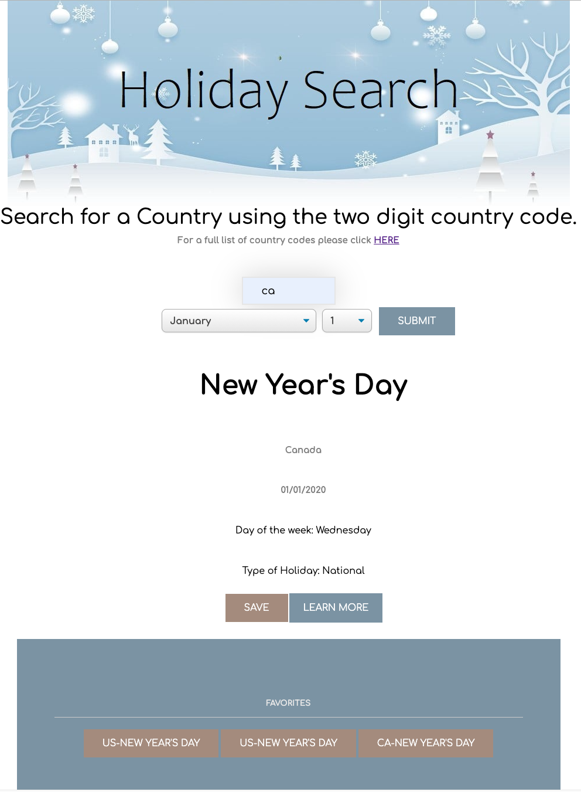
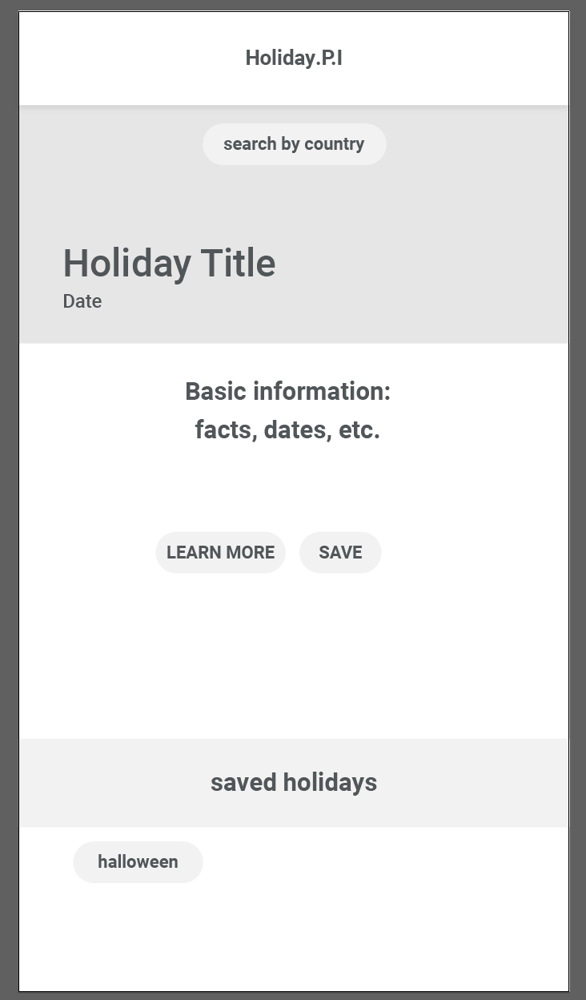

# Project_1
Bootcamp Student Project #1

HOLIDAY SEARCH APP!

# MACS PROJECT 1 Description
For this project we created a holiday searching app that will allow the user to search by country, month, and day to retrieve what holiday is on that day using the Holiday API. Then there will be a button that will allow the user to learn more about that holiday through the wikipedia API.

# Technologies Used
This project used Javascript, CSS, HTML as our coding languages. This project also used the Holiday and Wikipedia Public API's to retrieve data. 

# Link to deployed application
https://gannacon.github.io/Project_1/

# Screenshot

## Application Requirements

Our project should fulfill the following requirements:

* Use a CSS framework.

* Be deployed to GitHub Pages.

* Be interactive (i.e., accept and respond to user input).

* Use at least two server-side APIs.

* Does not use alerts, confirms, or prompts (use modals).

* Use client-side storage to store persistent data.
* Be responsive.

* Have a polished UI.

* Have a clean repository that meets quality coding standards (file structure, naming conventions, follows best practices for class/id naming conventions, indentation, quality comments, etc.).

* Have a quality README (with unique name, description, technologies used, screenshot, and link to deployed application).

# PSEUDO CODE
Header
Search bar and a submit button. Input Country by two letter country code in the search bar.

A list of Holiday's for that country will appear.

With that list of countries you will have the option to learn more or save (radio button?) that country.
Saving the country will add it to your local storage so you can refresh the page and it will appear in your favorites bar on the bottom of the page.

"Learn More" will pull the wikipedia description for that holiday. Printed inside of the Div that is the holiday.

user input for country code - 
    linked button to take user to list of country codes.
dropdowns for months and days - control values of user input

